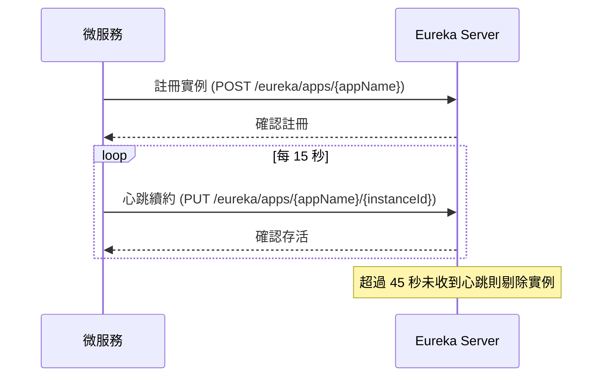
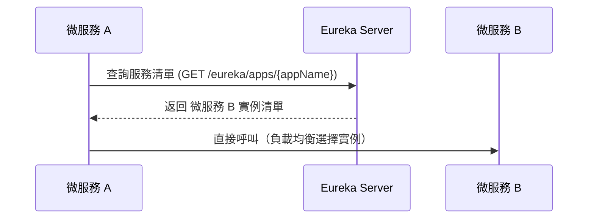

# Eureka Service


微服務生態系的服務註冊與發現中心，基於 Spring Cloud Netflix Eureka Server。負責接收微服務實例的自動註冊、心跳監控與服務發現，並透過
Spring Cloud Bus + RabbitMQ 支援動態配置刷新。

## 快速開始

### 前置需求

- Java 21
- Docker Desktop

### 使用 IntelliJ IDEA

1. `File` → `Open` → 選擇專案根目錄，等待 Gradle 同步完成
2. `Run` → `Edit Configurations` → `EurekaserviceApplication` → `Environment variables`
3. 輸入框貼上：`SECURITY_USERNAME=admin;SECURITY_PASSWORD=password`

| 變數                  | 開發用值       |
|---------------------|------------|
| `SECURITY_USERNAME` | `admin`    |
| `SECURITY_PASSWORD` | `password` |

4. 點擊 `EurekaserviceApplication` 旁的 ▶ 啟動
5. 開啟 http://localhost:8761/actuator/health 確認回傳 `{"status":"UP"}`

## 系統架構

### 服務註冊

微服務啟動時向 Eureka
發送註冊請求，之後定期發送心跳維持存活狀態（[官方文件](https://docs.spring.io/spring-cloud-netflix/docs/current/reference/html/) → `Registering with Eureka`）：

> 端點由 Eureka Server 內建，客戶端引入 Eureka Client 依賴後自動呼叫。



### 服務發現

微服務透過 Eureka
取得目標服務的實例清單後，直接發起呼叫（[官方文件](https://docs.spring.io/spring-cloud-commons/docs/current/reference/html/#spring-cloud-loadbalancer) → `Spring Cloud LoadBalancer`）：



## API 端點

| 端點                                           | 方法   | 說明            | 認證  |
|----------------------------------------------|------|---------------|-----|
| `/`                                          | GET  | Eureka Web UI | 需要  |
| `/eureka/apps`                               | GET  | 取得所有已註冊服務清單   | 不需要 |
| `/eureka/apps/{appName}`                     | GET  | 取得特定服務的實例清單   | 不需要 |
| `/eureka/apps/{appName}/{instanceId}`        | PUT  | 心跳續約          | 不需要 |
| `/eureka/apps/{appName}/{instanceId}/status` | PUT  | 更新實例狀態        | 不需要 |
| `/actuator/health`                           | GET  | 健康檢查          | 不需要 |
| `/actuator/busrefresh`                       | POST | 觸發全域配置刷新      | 需要  |

需認證的端點皆使用 HTTP Basic Auth（`SECURITY_USERNAME` / `SECURITY_PASSWORD`）。

## 環境變數

| 變數                       | 預設值 | 說明                         |
|--------------------------|-----|----------------------------|
| `SECURITY_USERNAME`      | 必填  | Basic Auth 帳號              |
| `SECURITY_PASSWORD`      | 必填  | Basic Auth 密碼              |
| `SERVER_HOST`            | 必填  | 實例對外主機位址（用於 Eureka 自我註冊）   |
| `SERVER_PORT`            | 必填  | 服務埠號                       |
| `SPRING_PROFILES_ACTIVE` | 必填  | 啟動環境（local / dev / prod）   |
| `CONFIG_SERVER_URI`      | -   | Config Server 位址（dev/prod） |
| `CONFIG_SERVER_USERNAME` | -   | Config Server 帳號（dev/prod） |
| `CONFIG_SERVER_PASSWORD` | -   | Config Server 密碼（dev/prod） |
| `RABBITMQ_HOST`          | -   | RabbitMQ 主機位址（dev/prod）    |
| `RABBITMQ_PORT`          | -   | RabbitMQ 連接埠（dev/prod）     |
| `RABBITMQ_USERNAME`      | -   | RabbitMQ 帳號（dev/prod）      |
| `RABBITMQ_PASSWORD`      | -   | RabbitMQ 密碼（dev/prod）      |

`local` profile 僅需 `SECURITY_USERNAME` 與 `SECURITY_PASSWORD`，Config Server 與 RabbitMQ 連線均停用。

## 客戶端微服務整合

其他微服務向 Eureka 註冊時需加入以下依賴與配置：

```kotlin
// build.gradle.kts
dependencies {
    implementation("org.springframework.cloud:spring-cloud-starter-netflix-eureka-client")
}
```

```yaml
# application.yml
spring:
  application:
    name: myservice # 對應 Eureka 上顯示的服務名稱

eureka:
  client:
    service-url:
      defaultZone: http://eurekaservice:8761/eureka/
```

Docker Compose 整合時，使用服務名稱作為主機位址：

```yaml
environment:
  - SPRING_PROFILES_ACTIVE=prod
  - EUREKA_CLIENT_SERVICEURL_DEFAULTZONE=http://eurekaservice:8761/eureka/
```

## 部署

以下指令在**部署目標主機**上執行，需已安裝 Docker 與 Docker Compose。Windows 和 Linux 流程一致。

### 部署目錄結構

將以下四個檔案放在同一個目錄下：

```
/opt/tata/eurekaservice/         # Linux 範例路徑（Windows 可自訂）
├── eurekaservice.jar             # 編譯產出
├── Dockerfile                    # 來源：docs/docker/Dockerfile
├── .dockerignore                 # 來源：docs/docker/.dockerignore
├── docker-compose.yml            # 來源：docs/docker/docker-compose.yml
└── .env                          # 來源：docs/docker/.env.example（填入實際值）
```

### 首次部署

1. 在專案開發機編譯 JAR：
   ```bash
   ./gradlew bootJar
   ```
2. 將 `build/libs/eurekaservice.jar`、`docs/docker/Dockerfile`、`docs/docker/.dockerignore`、`docs/docker/docker-compose.yml`、`docs/docker/.env.example`
複製到部署主機的同一目錄
3. 將 `.env.example` 改名為 `.env`，填入實際的帳號密碼
4. 在該目錄下啟動：
   ```bash
   docker compose up -d
   ```

### 更新版本

1. 在開發機重新編譯 JAR
2. 將新的 `eurekaservice.jar` 複製到部署目錄，覆蓋舊檔
3. 重新建構並啟動：
   ```bash
   docker compose up -d --build
   ```

### 驗證

部署完成後確認服務狀態（`<username>` / `<password>` 為 `.env` 中設定的值）：

```bash
docker compose ps
curl http://localhost:8761/actuator/health
curl -u <username>:<password> http://localhost:8761/
```

### 常用維運指令

| 指令                                     | 說明        |
|----------------------------------------|-----------|
| `docker compose logs -f eurekaservice` | 即時查看日誌    |
| `docker compose restart eurekaservice` | 重啟服務      |
| `docker compose down`                  | 停止並移除所有容器 |
| `docker compose build --no-cache`      | 重新建構映像    |

## 版本管理

本專案採用 [Semantic Versioning](https://semver.org/)，以 **Git Tag 作為唯一版本來源**。`build.gradle.kts` 建構時自動讀取最近的
Tag 作為版本號，無 Tag 則為 `0.0.1-SNAPSHOT`。

### 版號規則

| 版號位置  | 何時遞增         | 範例                  |
|-------|--------------|---------------------|
| MAJOR | 重大架構變更、技術棧升級 | `v1.0.0` → `v2.0.0` |
| MINOR | 新增功能、配置結構調整  | `v1.0.0` → `v1.1.0` |
| PATCH | Bug 修復、小幅調整  | `v1.0.0` → `v1.0.1` |

### 發版流程

```bash
./gradlew build                    # 1. 確認測試通過
git add <files>                    # 2. Commit 變更
git commit -m "[feat] 功能描述"
git tag v1.0.0                     # 3. 打 Tag 定版
git push && git push --tags        # 4. Push
```

然後到伺服器執行[更新版本](#更新版本)即可。

### Commit 訊息格式

```
[類型] 中文描述
```

| 類型         | 說明        |
|------------|-----------|
| `feat`     | 新增功能      |
| `fix`      | 修復 Bug    |
| `refactor` | 重構（不影響功能） |
| `docs`     | 文件更新      |
| `test`     | 測試相關      |
| `config`   | 配置檔變更     |

## 參考資源

- [Spring Cloud Netflix Eureka 官方文件](https://docs.spring.io/spring-cloud-netflix/docs/current/reference/html/)
- [Spring Cloud LoadBalancer 官方文件](https://docs.spring.io/spring-cloud-commons/docs/current/reference/html/#spring-cloud-loadbalancer)
- [Spring Cloud Bus 官方文件](https://docs.spring.io/spring-cloud-bus/docs/current/reference/html/)
- [RabbitMQ 管理指南](https://www.rabbitmq.com/management.html)
